# Introduction
Stock market is commonly considered unpredictable. However, instead of focusing on the price forecast, studies of volatility enables trading firms and investors to handle the risks of huge losses. In fact, Robert F. Engle and Clive Granger won the Nobel prize in economics in 2003 by the development of Autoregressive Conditional Heteroskedasticity (ARCH) model. They leveraged this model to identify statistical patterns of asset volatility [1]. Despite the success of ARCH models, there are several different options we can consider when it comes to modeling time-varying volatility including ARIMA, GARCH, and POMP. Given that the assumptions behind these models are different, applying these models might provide different aspects and insights into the studies of time-varying volatility in assets. To compare how these models perform in fitting to the volatility, we choose NASDAQ 100 index, which is a well-known index commonly used to value the technology stocks, from the American stock market from 1971 to date [2]. We simply relies on `yfinance` package to gather the historical data in Python and perform the following analysis in R [3]. Finally, we demonstrated that the ARIMA model cannot fully capture the time-series behaviors of volatility. Although GARCH suggested a better result based on the likelihood estimate, realizing Breto's model with POMP outperformed the previous two models. In the end, we identified that the leverage effect was converged to a really low value in parameter scanning. Therefore, we built a simplified version of stochastic volatility model to verify the essentiality of the leverage effect. Interestingly, the likelihood estimate guided us to consider that the leverage effect is required even if the value was low.


<br>

# Exploratory Data Analysis (EDA)


```
##         Date   Open   High    Low  Close Volume Dividends Stock.Splits
## 1 1971-02-05 100.00 100.00 100.00 100.00      0         0            0
## 2 1971-02-08 100.84 100.84 100.84 100.84      0         0            0
## 3 1971-02-09 100.76 100.76 100.76 100.76      0         0            0
## 4 1971-02-10 100.69 100.69 100.69 100.69      0         0            0
## 5 1971-02-11 101.45 101.45 101.45 101.45      0         0            0
## 6 1971-02-12 102.05 102.05 102.05 102.05      0         0            0
```

```
## [1] 13416     8
```

```
##       Date                 Open               High               Low          
##  Min.   :1971-02-05   Min.   :   54.87   Min.   :   54.87   Min.   :   54.87  
##  1st Qu.:1984-05-15   1st Qu.:  276.56   1st Qu.:  276.65   1st Qu.:  276.28  
##  Median :1997-08-20   Median : 1337.43   Median : 1347.46   Median : 1322.09  
##  Mean   :1997-09-01   Mean   : 2603.55   Mean   : 2621.36   Mean   : 2583.43  
##  3rd Qu.:2010-12-17   3rd Qu.: 2848.77   3rd Qu.: 2867.56   3rd Qu.: 2825.53  
##  Max.   :2024-04-18   Max.   :16517.24   Max.   :16538.86   Max.   :16393.90  
##      Close              Volume            Dividends  Stock.Splits
##  Min.   :   54.87   Min.   :0.000e+00   Min.   :0   Min.   :0    
##  1st Qu.:  276.53   1st Qu.:0.000e+00   1st Qu.:0   1st Qu.:0    
##  Median : 1335.53   Median :6.546e+08   Median :0   Median :0    
##  Mean   : 2603.53   Mean   :1.206e+09   Mean   :0   Mean   :0    
##  3rd Qu.: 2847.29   3rd Qu.:1.932e+09   3rd Qu.:0   3rd Qu.:0    
##  Max.   :16442.20   Max.   :1.162e+10   Max.   :0   Max.   :0
```

<br>
There are 13416 rows of data for `IXIC.csv` and no missing values. We will only use the closing data recorded in the "Close" column in the following analysis. However, as we stated in the introduction, this work focuses on the analysis of volatility which requires the calculation of returns. To do so, we generated a new column "Return" by calculating the formula
$$
Return = log(x_t)-log(x_{t-1})
$$
, where $x$ stands for the closing prices and $t$ stands for days. Furthermore, we centered the "Returns" by removing the mean values of the "Returns" which was saved in "demeaned" column [4].
<br>

## Price Plots

<br>
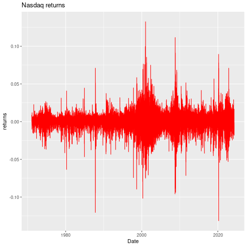
<br>
According to the plots, we can easily see that both returns and demeaned returns ignored the trend of the increasing prices, but it was hard to identify patterns but many large spikes by naked eye. Additionally, autocorrelation of the demeaned returns showed a quick drop from 0 to 1 lag, but multiple significant lags popped up after lag=7.

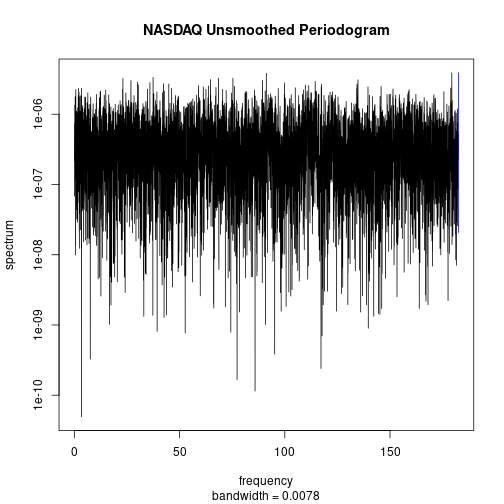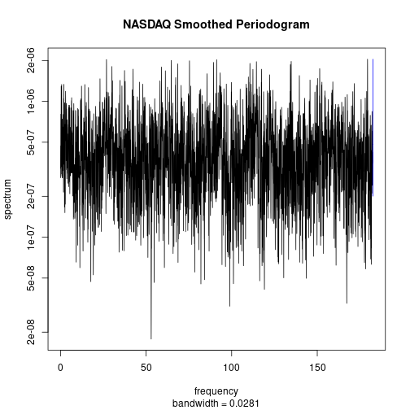

```
## The peak frequency of NASDAQ:
```

```
## [1] 179.3637
```

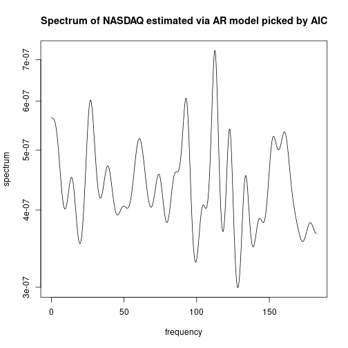

```
## [1] 112.6453
```
<br>
Either manually chosen or AIC-based frequency in the analysis of periodogram did not separate out any strong periodic behaviors. Althoguh it is expected to see no seasonal/periodic patterns from the returns, we can try using ARIMA model to identify hidden statistical characteristics.
<br>


# Fitting ARIMA models to the demeaned returns
## Model fitting
Leveraging the AIC-based method taught in the first half of the semester [10], we scanned the parameter for AR and MA from 0 to 5. As a result, the AIC table indicated that AR(5) and MA(5) can provide the best-fit model.

<br>

```
## Loading required package: knitr
```


|    |       MA0|       MA1|       MA2|       MA3|       MA4|       MA5|
|:---|---------:|---------:|---------:|---------:|---------:|---------:|
|AR0 | -79158.41| -79160.88| -79159.58| -79159.10| -79157.98| -79156.05|
|AR1 | -79160.82| -79158.85| -79157.56| -79157.13| -79155.98| -79154.04|
|AR2 | -79159.51| -79157.53| -79155.55| -79155.13| -79154.00| -79152.05|
|AR3 | -79159.15| -79157.12| -79155.12| -79153.12| -79152.01| -79150.05|
|AR4 | -79158.07| -79156.07| -79154.06| -79152.05| -79150.03| -79148.08|
|AR5 | -79156.08| -79154.08| -79152.07| -79150.07| -79148.05| -79185.97|

```
## [1] -79185.97
```
<br>


## Diagnosis
After we obtained the ARMA(5,5) model, we can make diagnostic plots for the model. Apparently, the residuals were not perfectly normally distributed and not reaching homoscedasticity. The autocorrelation plot also showed significant lags, whereas all the points were inside the unit circle. Since the inverse roots still recoganized that the ARMA(5,5) could be a stable model, we will integrate it into GARCH models considering the heteroscedasticity of the residuals.

<br>


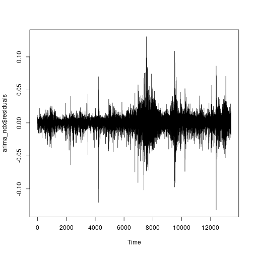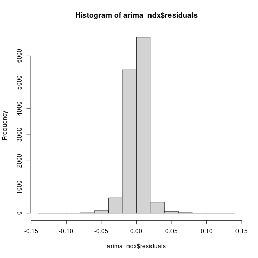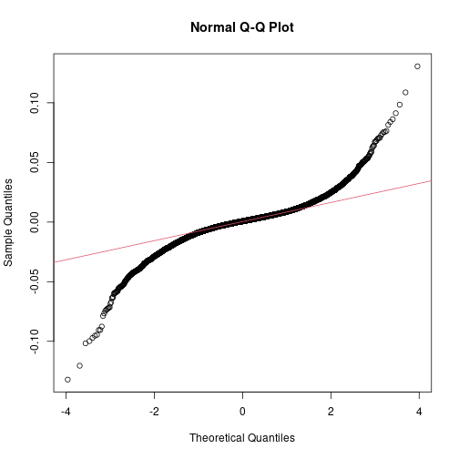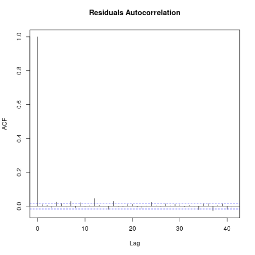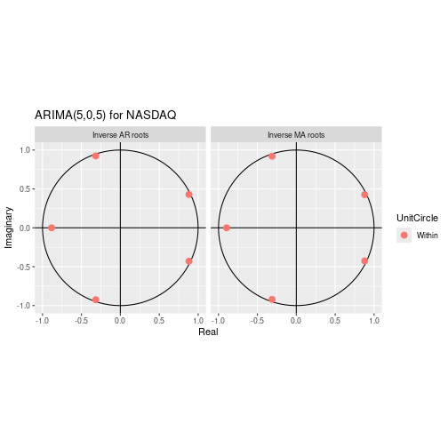
<br>


# Building GARCH models as benchmarks
## Model fitting
Due to the heteroscedasticity, GARCH models naturally become one of the ideal candidate models to deal with the residuals. Our group was inspired by the Final Project 14 in 2022 to initialize GARCH models with `fGARCH` package [5]. Using the function `garch`, we can fit the model combining ARMA(5,5) and GARCH(1,1). The method reported that coefficients of AR(5) and MA(5) were not significant and the log-likelihood value is about 43341.

<br>


```
## 
## Title:
##  GARCH Modelling 
## 
## Call:
##  garchFit(formula = ~arma(5, 5) + garch(1, 1), data = ndx$demeaned, 
##     cond.dist = c("norm"), include.mean = TRUE) 
## 
## Mean and Variance Equation:
##  data ~ arma(5, 5) + garch(1, 1)
## <environment: 0xef4dbf0>
##  [data = ndx$demeaned]
## 
## Conditional Distribution:
##  norm 
## 
## Coefficient(s):
##          mu          ar1          ar2          ar3          ar4          ar5  
##  8.6200e-19  -1.6325e-01   3.8457e-01   4.5923e-01  -2.9317e-01  -2.5228e-01  
##         ma1          ma2          ma3          ma4          ma5        omega  
##  3.0262e-01  -3.4923e-01  -4.8120e-01   2.4643e-01   2.8648e-01   1.4227e-06  
##      alpha1        beta1  
##  1.1260e-01   8.8021e-01  
## 
## Std. Errors:
##  based on Hessian 
## 
## Error Analysis:
##          Estimate  Std. Error  t value Pr(>|t|)    
## mu      8.620e-19   2.394e-04    0.000   1.0000    
## ar1    -1.632e-01   3.219e-01   -0.507   0.6121    
## ar2     3.846e-01   2.913e-01    1.320   0.1868    
## ar3     4.592e-01   2.409e-01    1.906   0.0566 .  
## ar4    -2.932e-01   1.967e-01   -1.491   0.1360    
## ar5    -2.523e-01   6.387e-02   -3.950 7.83e-05 ***
## ma1     3.026e-01   3.222e-01    0.939   0.3477    
## ma2    -3.492e-01   3.296e-01   -1.059   0.2894    
## ma3    -4.812e-01   2.664e-01   -1.807   0.0708 .  
## ma4     2.464e-01   2.138e-01    1.153   0.2490    
## ma5     2.865e-01   6.787e-02    4.221 2.44e-05 ***
## omega   1.423e-06   1.554e-07    9.158  < 2e-16 ***
## alpha1  1.126e-01   6.168e-03   18.257  < 2e-16 ***
## beta1   8.802e-01   6.229e-03  141.319  < 2e-16 ***
## ---
## Signif. codes:  0 '***' 0.001 '**' 0.01 '*' 0.05 '.' 0.1 ' ' 1
## 
## Log Likelihood:
##  43360.37    normalized:  3.23199 
## 
## Description:
##  Tue Apr 23 22:48:56 2024 by user:  
## 
## 
## Standardised Residuals Tests:
##                                  Statistic     p-Value
##  Jarque-Bera Test   R    Chi^2  2971.62940 0.000000000
##  Shapiro-Wilk Test  R    W              NA          NA
##  Ljung-Box Test     R    Q(10)    21.04025 0.020814655
##  Ljung-Box Test     R    Q(15)    28.85263 0.016801931
##  Ljung-Box Test     R    Q(20)    40.49901 0.004317555
##  Ljung-Box Test     R^2  Q(10)    15.58709 0.112078248
##  Ljung-Box Test     R^2  Q(15)    24.01836 0.064782407
##  Ljung-Box Test     R^2  Q(20)    30.21465 0.066449459
##  LM Arch Test       R    TR^2     19.99554 0.067170354
## 
## Information Criterion Statistics:
##       AIC       BIC       SIC      HQIC 
## -6.461892 -6.454061 -6.461895 -6.459280
```
<br>
According to the previous report, AR(4) and MA(4) were only significant coefficients; thus, we fitted a new model again by combining ARMA(4,4) and GARCH(1,1) instead. The result showed an improved log-likelihood value which is 43361.47.
<br>


```
## 
## Title:
##  GARCH Modelling 
## 
## Call:
##  garchFit(formula = ~arma(4, 4) + garch(1, 1), data = ndx$demeaned, 
##     cond.dist = c("norm"), include.mean = TRUE) 
## 
## Mean and Variance Equation:
##  data ~ arma(4, 4) + garch(1, 1)
## <environment: 0x15447228>
##  [data = ndx$demeaned]
## 
## Conditional Distribution:
##  norm 
## 
## Coefficient(s):
##          mu          ar1          ar2          ar3          ar4          ma1  
## -8.6200e-19  -1.7286e-02  -7.0341e-01   2.3529e-01   1.9082e-01   1.6112e-01  
##         ma2          ma3          ma4        omega       alpha1        beta1  
##  7.2543e-01  -1.0854e-01  -2.0543e-01   1.3972e-06   1.1121e-01   8.8167e-01  
## 
## Std. Errors:
##  based on Hessian 
## 
## Error Analysis:
##          Estimate  Std. Error  t value Pr(>|t|)    
## mu     -8.620e-19         NaN      NaN      NaN    
## ar1    -1.729e-02         NaN      NaN      NaN    
## ar2    -7.034e-01   2.303e-02  -30.542  < 2e-16 ***
## ar3     2.353e-01         NaN      NaN      NaN    
## ar4     1.908e-01   6.027e-02    3.166 0.001546 ** 
## ma1     1.611e-01         NaN      NaN      NaN    
## ma2     7.254e-01         NaN      NaN      NaN    
## ma3    -1.085e-01         NaN      NaN      NaN    
## ma4    -2.054e-01   5.573e-02   -3.686 0.000228 ***
## omega   1.397e-06   1.461e-07    9.566  < 2e-16 ***
## alpha1  1.112e-01   5.844e-03   19.030  < 2e-16 ***
## beta1   8.817e-01   5.834e-03  151.131  < 2e-16 ***
## ---
## Signif. codes:  0 '***' 0.001 '**' 0.01 '*' 0.05 '.' 0.1 ' ' 1
## 
## Log Likelihood:
##  43363.89    normalized:  3.232252 
## 
## Description:
##  Tue Apr 23 22:49:24 2024 by user:  
## 
## 
## Standardised Residuals Tests:
##                                  Statistic    p-Value
##  Jarque-Bera Test   R    Chi^2  3026.27420 0.00000000
##  Shapiro-Wilk Test  R    W              NA         NA
##  Ljung-Box Test     R    Q(10)    16.86799 0.07733665
##  Ljung-Box Test     R    Q(15)    24.70717 0.05401690
##  Ljung-Box Test     R    Q(20)    33.14187 0.03255062
##  Ljung-Box Test     R^2  Q(10)    16.19772 0.09411054
##  Ljung-Box Test     R^2  Q(15)    24.64859 0.05486651
##  Ljung-Box Test     R^2  Q(20)    30.93607 0.05604009
##  LM Arch Test       R    TR^2     20.42558 0.05945167
## 
## Information Criterion Statistics:
##       AIC       BIC       SIC      HQIC 
## -6.462714 -6.456002 -6.462716 -6.460475
```
<br>
However, the residuals in `fGARCH` is not standardized that might lead to some issues [6]. We finally decided to move on to using `garch` function from `tseries` like the lecture slides [4]. Considering the models we found in `fGARCH`, we built the same models again with the `garch` function. Expectedly, the combination of ARMA(4,4) and GARCH(1,1) reported the best likelihood value among the three while the value is worse than it was in the `fGARCH`-based models.
<br>

```
## 'log Lik.' 43236.63 (df=3)
```

```
## 'log Lik.' 43244.45 (df=3)
```

```
## 'log Lik.' 43265.61 (df=3)
```
<br>

## Diagnosis
We relies on the same procedure to make diagnostic plots. Indeed, discernible improvement was shown, but the assumption of equal variances and normal distribution of residuals were not perfectly satisfied. Even the lag=1 was identified as signficiant in the ACF plot. The issue led us to consider POMP models in the next section.

<br>
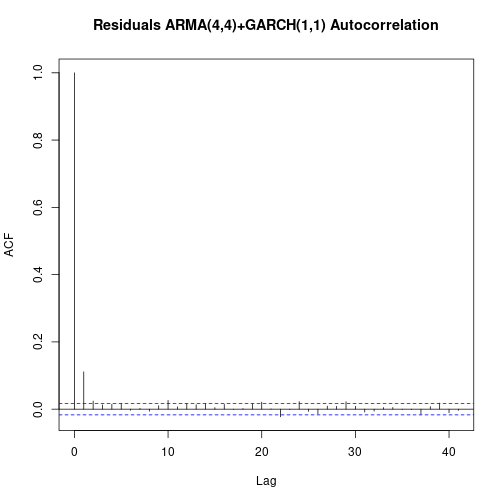
<br>


# Stochastic volatility models
The above analysis including ARIMA and GARCH indicated that there is room to improve the models of the NASDAQ volatility. We are inspired by the Breto's model and lecture slides Chapter 16 to realize the stochastic volatility models with POMP. The model follows four points. First, volatility is modeled as a stochastic latent process. Second, return offers the measurement that partially observes volatility. Third, our aim is to apply POMP to model "leverage effect" which stands for negative returns (typically refers to a sharp drop/shock) the increases of volatility [11]. Lastly, mathematically, we have
$$
Y_n = e^{H_n/2}\epsilon_n \\
H_n = μ_h(1 − \phi) + \phi H_{n−1} + \beta_{n−1}R_n e^{−H_{n−1}/2} + \omega_n \\
G_n = G_{n−1} + \nu_n
$$
where $\beta_n=Y_n\sigma_n\sqrt{1-\phi^2}$, ${\epsilon_n}$ is an iid $N(0, 1)$, ${\nu_n}$ is an iid $N(0, \sigma^2_\nu)$, and ${\omega_n}$ is an iid $N(0, \sigma^2_{w,n})$.
Conceptually, both a higher past volatility and a higher leverage component can upscale current volatility. As for the leverage term, a higher past return and a higher noise term R (a function of G) can increase the leverage effect. Interestingly, the leverage effect is scaled by the exponential of negative volatility which mitigate the leverage effect if the past volatility is high. After understanding the mathematical setups, we then start building the model like what we did for homework 7 [12].


<br>

# Set up different level of modeling (different size)
From now on, we will be fitting models to data instead of simulated ones. Following the lecture slides, we consider that different sample numbers and replicates can influence the performance of particle filters and the POMP model. We then test the model in 3 different size levels.

<br>


## Local search
### Test the model and likelihood estimate
We firstly test the model and estimate log likelihood with the initial guess. As one can see, the likelihood value is not comparable to the likelihood values of GARCH. The value is even lower than the initial estimation for S&P 500 in the lecture slides Chapter 16. However, we will be locally searching the parameters for the model [4].

<br>

```
##           est            se 
## -1.796512e+04  2.911784e-01
```

### Iterative filtering 
In this step, we simply adapted the code and inital settings from the lecture slides considering the similar volatility between S&P500 and NASDAQ100. We can see that the diagnosis plot displayed that `loglik` showed a quick increase followed by a gradual drease. This implies that the model might be overfitted and stuck in a local maxima. In spite of a bad model fitting, `sigma_eta` and `sigma_nu` almost got convergences. In contrast, other parameters were not really converged to a small range of values. Since these are common issues in local search, we will move on to global search for a more stable result. The pairplot also confirms the finding; `sigma_nu` and `sigma_eta` tended to settle at a narrow range of values, but `phi` did not. However, this plot suggests a potentially optimal value for `mu_h` which was not shown in the diagnosis plot.

<br>

<br>

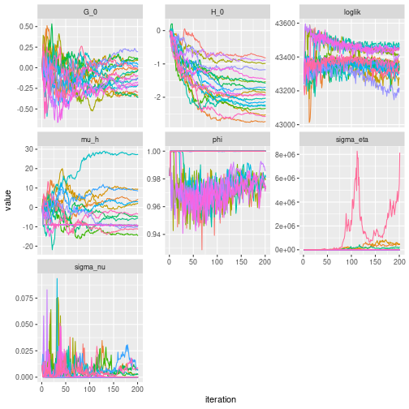
<br>
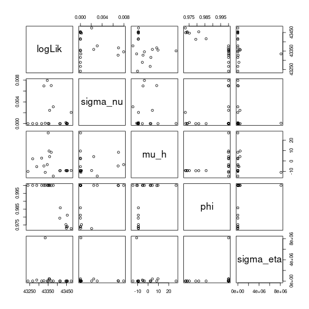
<br>


## Global search
We fed the model with the same ranges used for S&P500 from the lecture slides [4]. On one hand, the diagnosis plot showed a better convergence in `G_0`. Nonetheless, although only one samplwas not settled in `sigma_nu`, `mu_h`, `phi`, and `sigma_eta` did not converge well. That being said, the loglik indeed reached its maximum in the global search. On the other hand, the parameters `mu_h` and `sigma_eta` were really settled in a samll range of values with maximized likelihood. Based on this finding, we are interested in fixing the parameters to obtain profile likelihood. While we have two options here, `mu_h` governs the log volatility with another parameter `phi`. Without considering any realistic assumption behind, it is intuitive to concern an nonlinear parameter space. To simplify the problem, we will focus on `sigma_eta` which decides the magnitude of the log volatility individually and independently.

<br>

<br>
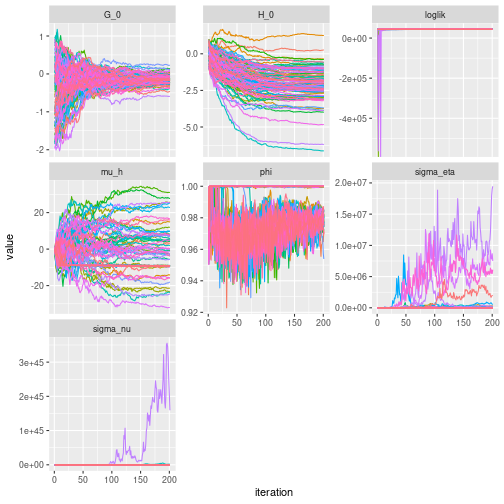
<br>
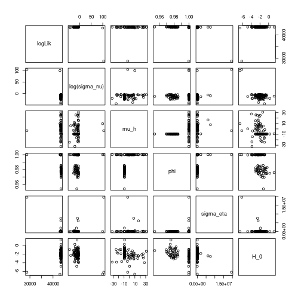
<br>

Before we perform the analysis of profile likelihood, we can take a look at the likelihood estimation of the best model. The maximum of the value reached 3483 which is already better than GARCH and ARIMA, but the standard error is quite high.

<br>

```
##    Min. 1st Qu.  Median    Mean 3rd Qu.    Max. 
##   43471   43473   43475   43476   43479   43483
```

```
##    Min. 1st Qu.  Median    Mean 3rd Qu.    Max. 
##   0.825   1.096   1.400   1.355   1.704   1.751
```
<br>

## Construct profile likelihood by fixing $\sigma_{\eta}$
Then, we applied `Np=2000` and `Nmif=200` to re-run the model for the construction of profile likelihood [7, 8]. According to the CI, we knew that the valid range COULD BE between 0.54 to 1 for `sigma_eta`, whereas the samples we got were pretty few. We have tried higher `Np` or `Nmif` which resulted in more than the computation more than 5 hours on GreatLakes. Coming back to the pairplot, we can see that `mu_h` was settled at about -8.9, `sigma_nu` was converged to 0.001, `phi` was at 0.96. 


<br>

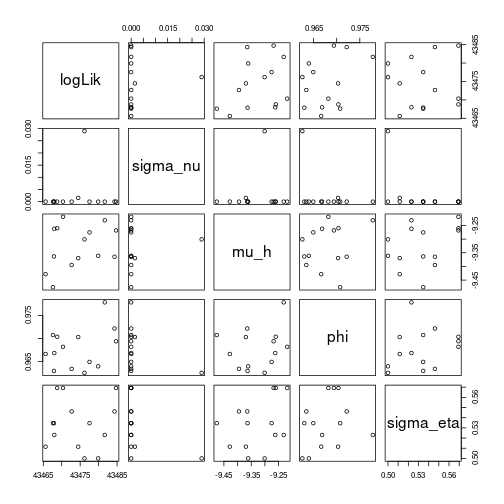
<br>

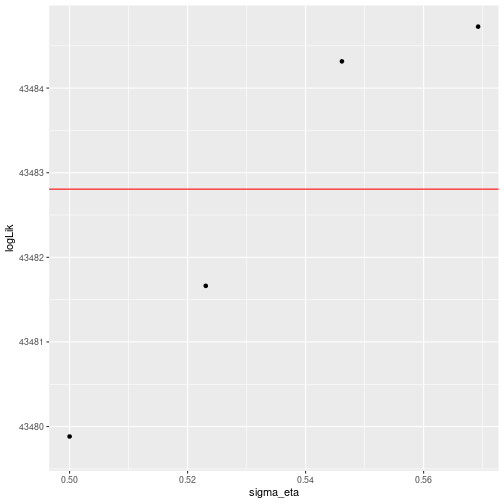
<br>

```
##    Min. 1st Qu.  Median    Mean 3rd Qu.    Max. 
##   43484   43484   43485   43485   43485   43485
```

```
##    Min. 1st Qu.  Median    Mean 3rd Qu.    Max. 
##  0.3978  0.5054  0.6131  0.6131  0.7207  0.8284
```

<br>


# Volatility model without leverage
From the result above we find that $\sigma_{\nu}$ almost converges to 0 and $G_0$ also converges to a scope near zero. So we wonder if a simple model without leverage is enough to catch the trend and stochastic volatility. Practically, we simplify Breto's model by setting $G_0$ to $0$ and removing leverage term $R_n$.

Mathmetically, then we have
$$
Y_n = e^{H_n/2}\epsilon_n \\
H_n = \mu_h(1-\phi) + \phi H_{n-1} + w_n
$$
where {$w_n$} is i.i.d r.v. following $\mathcal{N}(0,\sigma_{w}^2)$. And 
$$
\sigma_{w}^2 = \sigma_{\eta}^2(1-\phi^2)
$$


## Basic testing

<br>
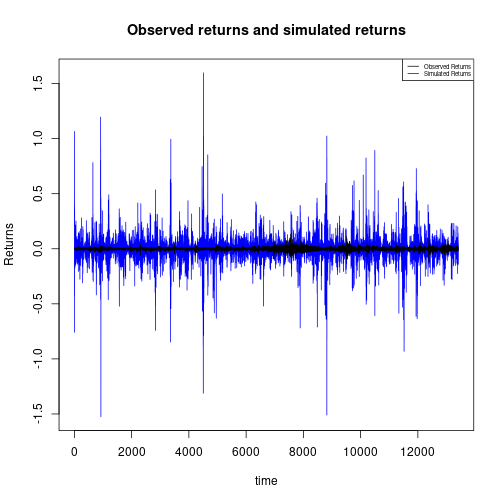


```
##          est           se 
## 18677.543710     2.293808
```


<br>


## Local search without leverage

<br>


<br>


<br>


```
##    Min. 1st Qu.  Median    Mean 3rd Qu.    Max. 
##   42775   42961   43110   43095   43237   43332
```

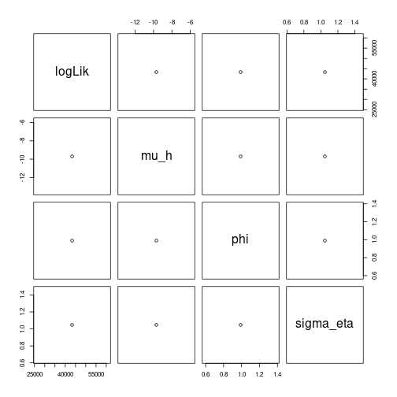


<br>
We find that the maximized likelihood becomes smaller than the original model, but now the number of fitted parameters is 4 and the parameter $\phi$ is no longer fluctuating intensely after 50 iterations. As the likelihood doesnt't converge well, we decided to move on to global search.
<br>

## Global search without leverage

<br>

<br>


```
##    Min. 1st Qu.  Median    Mean 3rd Qu.    Max. 
##   39559   43111   43210   42982   43245   43280
```

<br>
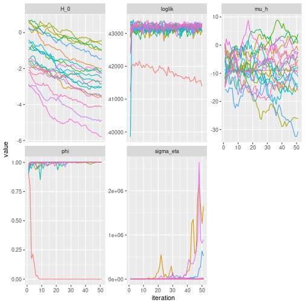

<br>

<br>
As a result, it seems like the parameters are much easier to converge than the Breto's model after 50 iterations, but the 4-parameter model still reported less likelihood values with global search than the original model. This means the model with leverage performed better.


# Conclusion
We found that neither ARIMA and GARCH can perfectly fit to the NASDAQ historical data. The diagnosis of residuals left some issues to address. From our perspective, the time window might be one of the reason to consider in the future. In fact, different trading systems, updated regulations, and economic background inject too many factors and noises into the 44 years of data. Although there obviously exist other variables to consider, our POMP model still outperfomed the previous two methods in terms of likelihood estimates. It is noteworthy that the low fitted parameter of the leverage effect led us to build a simplified stochastic models, but the worse likelihood value confirmed that the requirement of the leverage in the Breto's model. Additionally, the profile likelihood validated that the parameters found in the global search. That being said, it took much more time and efforts to tune the POMP models with 6 parameters compared to the GARCH model with only 3 paremeters. The trade-off between a good-fit model and a easy-to-use model actually guides us to choose one method over another for different scenarios. In the end, we envision that separating the data during specific events like economic crisis or COVID outbreaks would be a intriguing scope to study with the time-series models. We might be able to compare the different magnitudes of parameters like `sigma_eta` that lead to the same amount of volatility. It would be like the analysis of dynamic adaptive system to understand the branch points of the fates [8]. In conclusion, time-series models including ARIMA, GARCH, and Markov models like POMP might not be the best choice for forecasting, but they are really useful when it comes to analyzing the time-series patterns.


# Reference
1. The Sveriges Riksbank Prize in Economic Sciences in Memory of Alfred Nobel 2003. https://www.nobelprize.org/prizes/economic-sciences/2003/summary/
2. NASDAQ 100. https://www.nasdaq.com/
3. yfinance. https://pypi.org/project/yfinance/
4. Lecture slides Chapter 16. https://ionides.github.io/531w24/16/slides-annotated.pdf
5. Final Project 14 2022. https://ionides.github.io/531w22/final_project/project14/Blinded.html#fn5
6. The difference between garch{tseries} and garchFit{fGarch}. the acf of residuals^2 are different. What's wrong? Stack Exchange. https://stats.stackexchange.com/questions/426885/the-difference-between-garchtseries-and-garchfitfgarch-the-acf-of-residuals.
7. Final project 18 2022. https://ionides.github.io/531w22/final_project/project18/blinded.html
8. Lecture slides Chapter 14. https://ionides.github.io/531w24/14/slides-annotated.pdf 
9. Strogatz, S. H. (1994). Nonlinear dynamics and chaos: Lab demonstrations. 
10. Lecture slides Chapter 05. https://ionides.github.io/531w24/05/slides-annotated.pdf
11. Ait-Sahalia, Y., Fan, J., & Li, Y. (2013). The leverage effect puzzle: Disentangling sources of bias at high frequency. Journal of financial economics, 109(1), 224-249.
12. Homework 07 STATS531. 2024.
